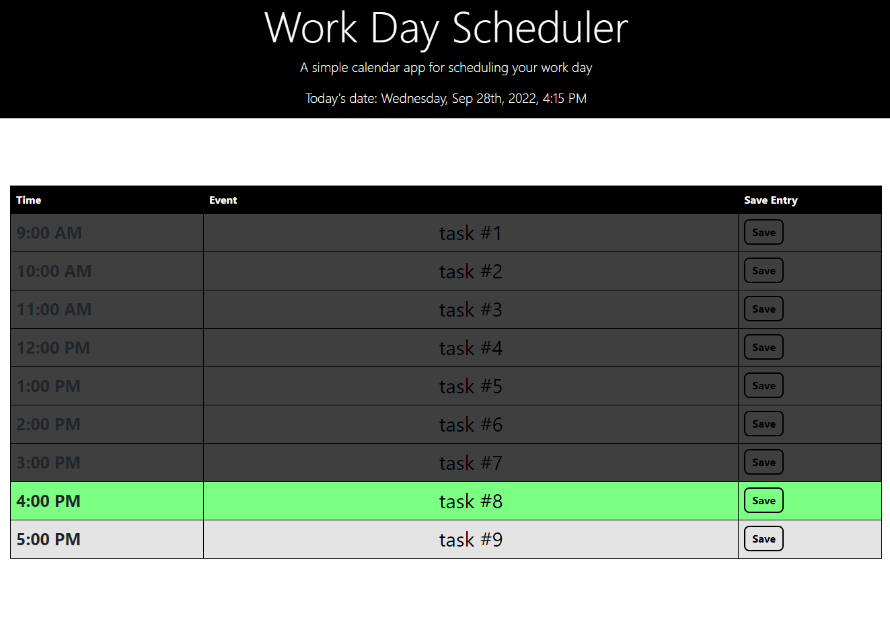
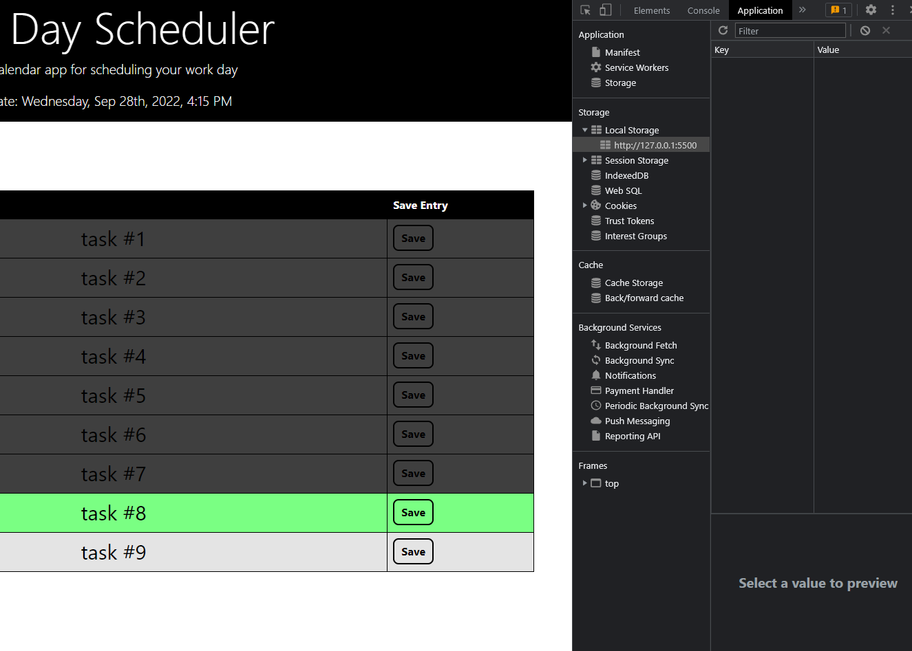
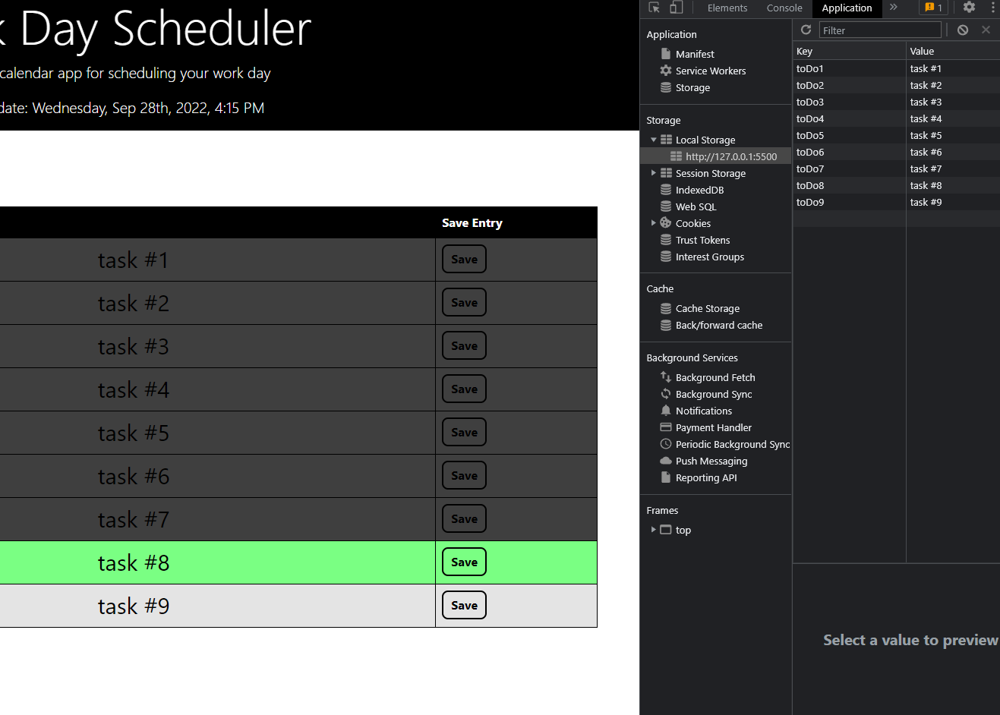

# Workday Scheduler

## Description
___
Workday Scheduler is a real-time color coded planner that helps organize your day. Save events or tasks in the text fields so that you can refer back to your daily schedule as needed. When the day is over, simply override the saved data by typing in tomorrow's events and clicking save. If the hour-block is in the past, it will appear greyed out, the current hour will always show as green, and time that has yet to pass is a pale off white grey.

## Images
___

## URL
___
* 